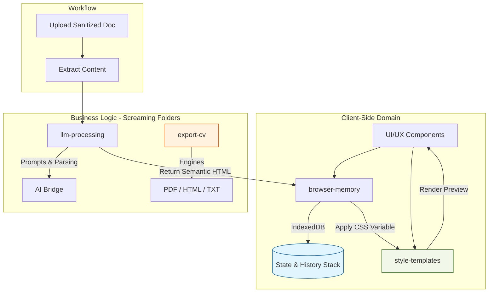

# PROJECT_SPEC: CV Optimizer (Professional Edition)

## 1. Vision & Architecture
This project follows a **Screaming Architecture** pattern. The folder structure itself communicates the application's domain and intent rather than just the framework's technical layers. Selected frameworks are Astro and Tailwind CSS v4. The intended visual language is **neobrutalism**. The repository is licensed under **Apache-2.0**.

### Core Architectural Principle: Content/Style Decoupling
The AI **must never** generate CSS. Its sole responsibility is generating **Semantic HTML** (Content). The application then injects pre-defined, hardcoded CSS (Styles) based on user selection.

## 2. Screaming Architecture Folder Structure
The `src/server/` directory is organized by feature and domain:

* `src/server/llm-processing/`: Logic for prompt engineering, document sanitization, and stateless API calls to LLMs.
* `src/styles/cv-templates/`: Hardcoded CSS files and logic for theme switching. Includes the **Color Picker API** integration to override CSS variables.
* `src/server/browser-memory/`: Implementation of IndexedDB persistence and the **Undo/Redo** stack (Memento pattern).
* `src/server/export-cv/`: Logic for converting the final state into `.pdf`, `.html`, and `.txt` (plain text).
* `src/components/`: Reusable interface elements.

## 3. Technical Specifications

### A. Content Management & State
* **Editing:** The generated CV must be rendered in an editable mode (e.g., `contenteditable` or controlled inputs).
* **Undo/Redo:** Every user change or template swap must be pushed to a history stack in `browser-memory` to allow `Ctrl+Z` / `Ctrl+Y` functionality.
* **Theming:** Templates are interchangeable. Changing a template simply swaps the CSS link/object without re-triggering the AI processing.

### B. Export Engines
* **PDF:** The current implementation uses `window.print()` / browser print preview. If an automated server-side PDF export is added later, it must preserve the same visual fidelity and template behavior as the browser output.
* **TXT:** A specific parser in `export-cv` must strip all HTML tags and CSS to provide a "clean-text" version for platforms that require manual copy-pasting.
* **HTML:** Export a standalone file with the hardcoded CSS inlined or in a `<style>` block.

### C. Style Control
* **CSS Templates:** Hardcoded in `src/styles/cv-templates`.
* **Dynamic Styling:** Use CSS Variables (e.g., `--primary-color`). The UI must provide a Color-Picker that updates this variable globally in the preview without affecting the content structure.

## 4. Security & Privacy Rules (Review)
* **Input Sanitization:** Before sending data to the AI or saving to IndexedDB, all inputs (PDF, HTML, YAML, TXT) must be stripped of script tags or malicious payloads.
* **UI Copy:** Maintain "Security through Obscurity".
    * *Rule:* Do not mention implementation details such as "IndexedDB" or internal PDF rendering tooling in the UI.
    * *Messaging:* "Your data is stored locally in this browser. If you switch devices, you must start over."

## 5. Instructions for AI Coding Assistants
* **Component Logic:** When creating the editor, implement a "change tracker" that syncs with `src/server/browser-memory`.
* **Style Logic:** Ensure that switching a template in `src/styles/cv-templates` does not reset the edited content in the state.
* **Visual Direction:** Preserve the repo's neobrutalist UI direction. Avoid replacing it with generic SaaS styling or neutral component-library aesthetics.
* **Export Logic:** The `.txt` export must be strictly plain text, optimized for ATS parsers (no markdown symbols like `**` or `#`).

## 6. Mandatory Script Modularization Rule
* **Hard Limit:** Ningun script, source file o test puede superar **500 LOC**.
* **Mandatory Refactor Trigger:** Si cualquier script supera 500 LOC, pasa a ser **candidato obligatorio de modularizacion** antes de continuar el feature.
* **Naming Rule:** Toda extraccion debe usar naming de **Screaming Architecture** orientado al dominio o workflow real (por ejemplo: `llm-document-upload`, `llm-model-selector`, `document-upload-history`, `optimizer-edition-export-workflow`).
* **No Generic Splits:** Queda prohibido modularizar con nombres genericos como `utils`, `helpers`, `misc`, `part2` o equivalentes que oculten responsabilidad.
