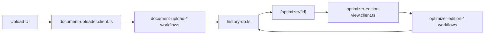

# Browser Memory

Este feature concentra el ciclo de vida local del CV optimizado dentro del navegador.

## Contenido

- `document-uploader.client.ts`: entrypoint del flujo de subida y optimización inicial.
- `document-upload-*.client.ts`: módulos de dominio para DOM, estados del upload, posiciones objetivo, preview, exportación e historial local.
- `optimizer-edition-view.client.ts`: entrypoint de la vista dedicada `/optimizer/[id]`.
- `optimizer-edition-*.client.ts`: módulos de dominio para estado del editor, exportación, traducción, toolbar y DOM dedicado.
- `history-*.ts`: persistencia y contratos de historial en browser-memory.
- `editor-undo-redo*.ts`: snapshots y navegación temporal del editor.

## Entry Points

- [`document-uploader.client.ts`](./document-uploader.client.ts)
- [`optimizer-edition-view.client.ts`](./optimizer-edition-view.client.ts)

## Data Flow

## Constraints

- Ningún archivo de este feature puede superar 500 LOC.
- Si un flujo crece por encima del límite, debe dividirse con naming de screaming architecture por caso de uso.
- La sanitización, el historial local y la exportación deben seguir siendo SSOT compartidas entre upload y editor dedicado.
