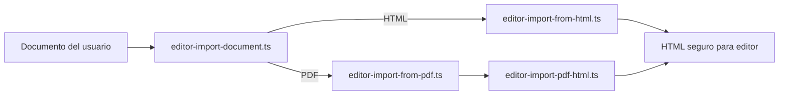

# Editor Import

Este feature abre el editor dedicado sin pasar por el pipeline de optimización con IA.

## Contenido

- `editor-import-document.ts`: router principal para decidir si la importación directa viene de PDF o HTML.
- `editor-import-from-html.ts`: sanitiza HTML y extrae solo el fragmento editable útil.
- `editor-import-from-pdf.ts`: valida el PDF, extrae texto y reconstruye HTML semántico básico.
- `editor-import-pdf-html.ts`: heurísticas puras para convertir texto de PDF en una estructura editable.
- `editor-import-validation.ts`: restringe formatos aceptados para la carga directa.

## Data Flow

## Constraints

- Solo PDF y HTML pueden abrir el editor sin IA.
- El importador PDF depende de texto seleccionable; no incluye OCR.
- La salida siempre debe ser HTML seguro compatible con el editor dedicado.
