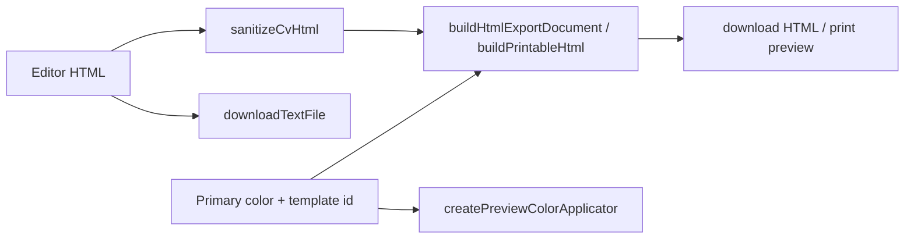

# Export CV

Este feature concentra la salida final del CV editado y la personalización visual usada durante la exportación.

## Contenido

- `cv-export.ts`: construye el HTML exportable, genera el TXT limpio, normaliza nombres de archivo y abre la vista de impresión.
- `cv-printable-editable-payload.ts`: embebe y recupera una carga editable canónica dentro del PDF generado por impresión.
- `cv-preview-color.ts`: aplica el color primario del preview editable sin tocar la estructura del contenido.

## Entry Points

- [`cv-export.ts`](./cv-export.ts)
- [`cv-preview-color.ts`](./cv-preview-color.ts)

## Data Flow

## Constraints

- La exportación debe mantener HTML semántico y seguro.
- El TXT exportado debe seguir siendo plain text sin markdown ni estilos.
- El flujo PDF actual depende de la impresión del navegador; cualquier exportador automático futuro debe preservar la misma plantilla visual.
