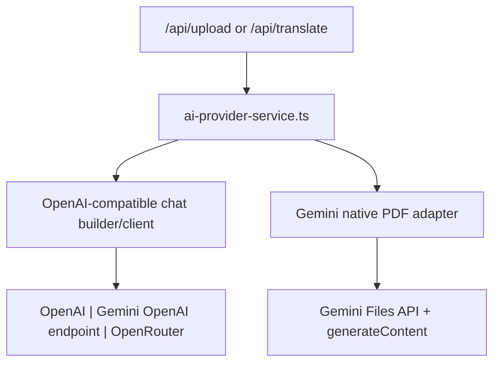

# LLM Processing

This folder contains the server-side AI integration for CV optimization and HTML translation.

## Main entry point

- [`ai-provider-service.ts`](./ai-provider-service.ts): provider-neutral facade used by `/api/upload` and `/api/translate`.

## File guide

- [`ai-provider-config.ts`](./ai-provider-config.ts): reads env vars, validates provider selection, resolves base URLs, and exposes the shared runtime config.
- [`ai-provider-openai-compatible-client.ts`](./ai-provider-openai-compatible-client.ts): runs the shared OpenAI-compatible `chat.completions` requests.
- [`ai-provider-openai-compatible-request.ts`](./ai-provider-openai-compatible-request.ts): builds shared prompts, messages, PDF file parts, and optional structured output settings.
- [`ai-provider-gemini-native-pdf.ts`](./ai-provider-gemini-native-pdf.ts): keeps Gemini’s native Files API PDF flow behind the generic facade.
- [`cv-optimizer-system-prompt.ts`](./cv-optimizer-system-prompt.ts): provider-neutral system prompt persona for CV optimization.

## Provider switching

Use `.env` or server env vars only:

- `AI_PROVIDER=openai`
- `AI_PROVIDER=gemini`
- `AI_PROVIDER=openrouter`

Required variables:

- `AI_PROVIDER`
- `AI_PROVIDER_API_KEY`
- `AI_PROVIDER_MODEL`

Optional variables:

- `AI_PROVIDER_BASE_URL`
- `AI_TEMPERATURE`
- `AI_MAX_OUTPUT_TOKENS`
- `AI_TOP_P`
- `AI_OPENROUTER_HTTP_REFERER`
- `AI_OPENROUTER_TITLE`

## Data flow

## Important behavior

- Browser translation still runs first in the client; the server provider is only the fallback.
- The remote translation fallback reuses `AI_PROVIDER_MODEL`; there is no separate translation model env var anymore.
- Gemini-specific naming from the previous integration was removed from the public service layer.
- PDF handling is provider-aware:
  - `gemini`: native Files API branch
  - `openai` and `openrouter`: OpenAI-compatible file content parts
- There is no provider fallback chain. Missing env vars or unsupported models return explicit errors.
