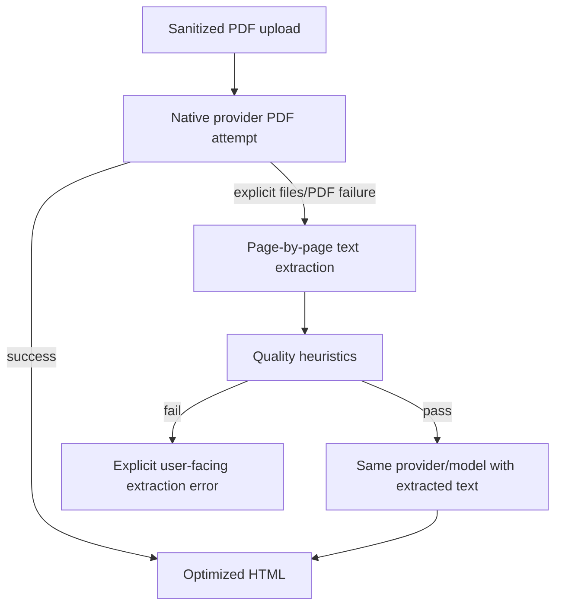

# PDF Processing

This folder contains the PDF-native and validated-text fallback workflow used by CV optimization.

## Main entry points

- [`pdf-native-optimization-workflow.ts`](/Users/leonardoleon/developer-stuff/cv-optimizer/src/server/llm-processing/pdf-processing/pdf-native-optimization-workflow.ts): native-first orchestration with allowlisted fallback to extracted text.
- [`pdf-text-extraction.ts`](/Users/leonardoleon/developer-stuff/cv-optimizer/src/server/llm-processing/pdf-processing/pdf-text-extraction.ts): page-by-page extraction and reconstruction using `pdfjs-dist`.
- [`pdf-text-quality.ts`](/Users/leonardoleon/developer-stuff/cv-optimizer/src/server/llm-processing/pdf-processing/pdf-text-quality.ts): fail-closed quality heuristics for extracted text.
- [`pdf-native-provider-fallback.ts`](/Users/leonardoleon/developer-stuff/cv-optimizer/src/server/llm-processing/pdf-processing/pdf-native-provider-fallback.ts): classifies provider failures to decide if text fallback is allowed.

## Data flow

## Important behavior

- Native PDF input is always attempted first.
- Text fallback is allowed only for explicit file/PDF capability, file-credits, or file-endpoint failures.
- Generic provider failures do not trigger fallback.
- If extraction quality is suspicious, the workflow fails with an explicit no-OCR message instead of sending incomplete text to the LLM.
