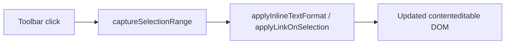

# Text Editor

Este feature concentra las utilidades de edición enriquecida que actúan sobre la selección activa dentro del CV editable.

## Contenido

- `active-selection-formatting.client.ts`: aplica y revierte formato inline seguro sobre selecciones válidas dentro del editor.
- `active-selection-formatting.client.test.ts`: cubre selección, restauración, formato inline y enlaces permitidos.

## Entry Points

- [`active-selection-formatting.client.ts`](./active-selection-formatting.client.ts)

## Data Flow

## Constraints

- El formato solo debe aplicarse dentro del editor activo.
- Los enlaces inseguros (`javascript:`, `data:`, `vbscript:`) deben rechazarse.
- La restauración de la selección no debe romper el flujo del toolbar del optimizador.
