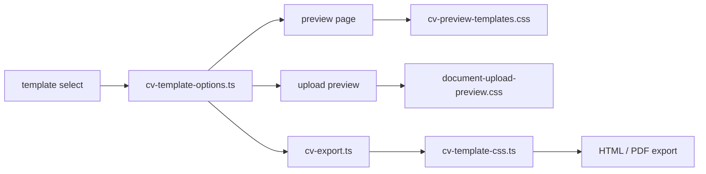

# CV Templates

Este folder concentra las plantillas visuales del CV para mantener sincronizados el preview editable y la exportación final.

## Contenido

- `cv-preview-templates.css`: estilos globales del preview editable dentro de la vista del optimizador.
- `document-upload-preview.css`: estilos globales del preview editable y del historial local en el flujo de upload.
- `cv-template-css.ts`: reglas CSS que se inyectan en las exportaciones HTML y PDF.
- `cv-template-options.ts`: catálogo de plantillas, ids válidos y normalización del valor seleccionado.

## Entry Points

- [`cv-template-options.ts`](./cv-template-options.ts): SSOT para ids y labels de plantillas.
- [`cv-template-css.ts`](./cv-template-css.ts): genera el CSS de cada variante para exportación.
- [`cv-preview-templates.css`](./cv-preview-templates.css): aplica la misma familia visual al preview editable.
- [`document-upload-preview.css`](./document-upload-preview.css): estiliza el workspace de upload, chips, logs y preview previo al editor dedicado.

## Data Flow

## Constraints

- `default` se conserva como baseline de legibilidad.
- Las variantes deben seguir siendo de una sola columna y semánticas para no degradar lectura humana ni parsing ATS.
- Si cambias la jerarquía visual de una variante, revisa tanto preview como exportación para evitar desalineaciones.
